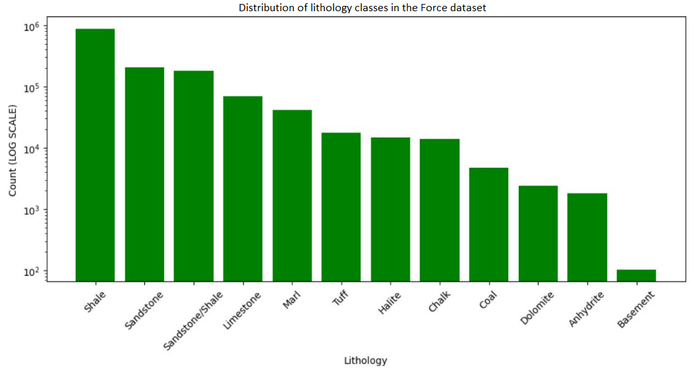
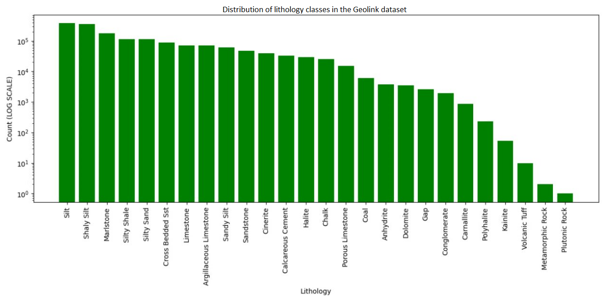

# Implemented Datasets

There are two currently implemented datasets:

## FORCE Dataset

### Overview
This dataset was taken from the FORCE 2020 competition.

### Dataset Access
To access the dataset, CSV files for the following subsets need to be opened:

- **Train Data**: This is the data used to train models.
- **Leaderboard Test Data**: Data provided for real-time evaluation during the competition.
- **Hidden Test Data**: Released post-competition for final evaluation.

### Competition Details
During the competition, the test data was split into two parts:
1. **Leaderboard Test Data**: Available to all participants during the competition for the purpose of provisional ranking.
2. **Hidden Test Data**: Released only after the competition ended, used for generating the final leaderboard.

### Lithology Distribution

There are **12 lithology classes** in total.

The dataset includes a diverse lithology distribution, as depicted below:

## Geolink Dataset

### Overview
This class contains functions to interface with the Geolink dataset.

### Dataset Access
The dataset is comprised of LAS files, with each file corresponding to a single well's data. Accessing this information involves a two-step process:

1. **Directory Iteration**: Traverse the dataset directory.
2. **File Opening**: Utilize the `lasio` library to read each LAS file.

### Lithology Distribution

There are **26 lithology classes** in total.

The dataset includes a diverse lithology distribution, as depicted below:

