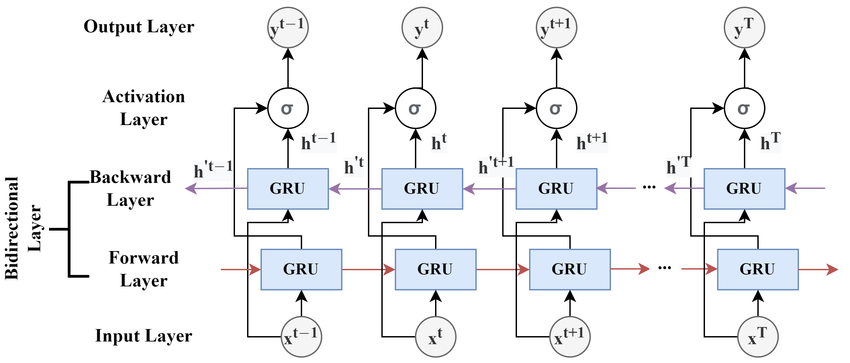
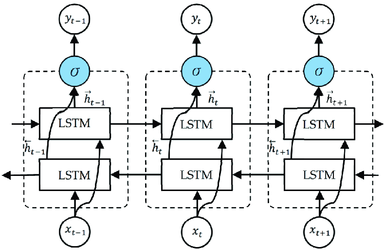
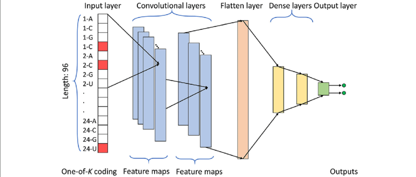

# Implemented models

## BiGRU

A Bidirectional GRU, or **BiGRU**, is a sequence processing model that consists of two GRUs. One taking the input in a forward direction, and the other in a backwards direction. It is a bidirectional recurrent neural network with only the input and forget gates.

The implemented architecture in `bigru.py` consists of bidirectional GRU layer followed by a fully connected layer for classification.

#### Attributes:

- `input_size (int)`: The number of expected features in the input.
- `hidden_size (int)`: The number of features in the hidden state.
- `num_layers (int)`: Number of recurrent layers.
- `batch_first (bool)`: If True, input is provided as (batch, seq, feature); otherwise, it's (seq, batch, feature).
- `dropout (float)`: Dropout probability applied to the outputs of each GRU layer (except the last one).
- `bidirectional (bool)`: If True, becomes a bidirectional GRU.
- `cfg`: Configuration dictionary containing hyperparameters.
- `device`: Device to perform computations.

## BiLSTM

A Bidirectional Long Short-Term Memory (**BiLSTM**) network is an extension of the traditional LSTM (Long Short-Term Memory) network. It consists of two LSTM layers: one processing the input sequence in a forward manner and the other processing it in a backward manner. A sample architecture can be seen in the following image:

The implemented architecture in `bilstm.py` consists of bidirectional LSTM layer followed by a fully connected layer for classification.

#### Attributes:

- `input_size (int)`: The number of expected features in the input.
- `hidden_size (int)`: The number of features in the hidden state.
- `num_layers (int)`: Number of recurrent layers.
- `batch_first (bool)`: If True, input is provided as (batch, seq, feature); otherwise, it's (seq, batch, feature).
- `dropout (float)`: Dropout probability applied to the outputs of each LSTM layer (except the last one).
- `bidirectional (bool)`: If True, becomes a bidirectional LSTM.
- `cfg`: Configuration dictionary containing hyperparameters.
- `device`: Device to perform computations.

## CNN

A 1D **Convolutional Neural Network** (CNN) is primarily designed to process sequential data, such as time series. In our case, the input of the CNN is the sequences of logs extracted from the wells. CNNs is mainly motivated by their inherent capability to fuse feature extraction and classification into a single adaptive learning body. 

The implemented architecture in `cnn.py` consists of five convolutional layers with ReLU activation followed by Batch Normalizations and Dropouts. The last layer is a fully connected layer for classification.

#### Attributes:

- cfg (dict): Configuration dictionary containing hyperparameters
- logs (list of strings): List of logs used
- seq_size (int): Size of the input sequence
- batch_size (int): Size of the batch
- lr (float): Learning rate for the model
- epochs (int): Number of epochs to train the model
- input_channels (int): amount of input channels (number of logs)
- num_classes (int): number of lithology classes (output size)
- device (str): Device to use for the training (cpu or gpu)
- verbose (bool): Print state of the training and evaluation process